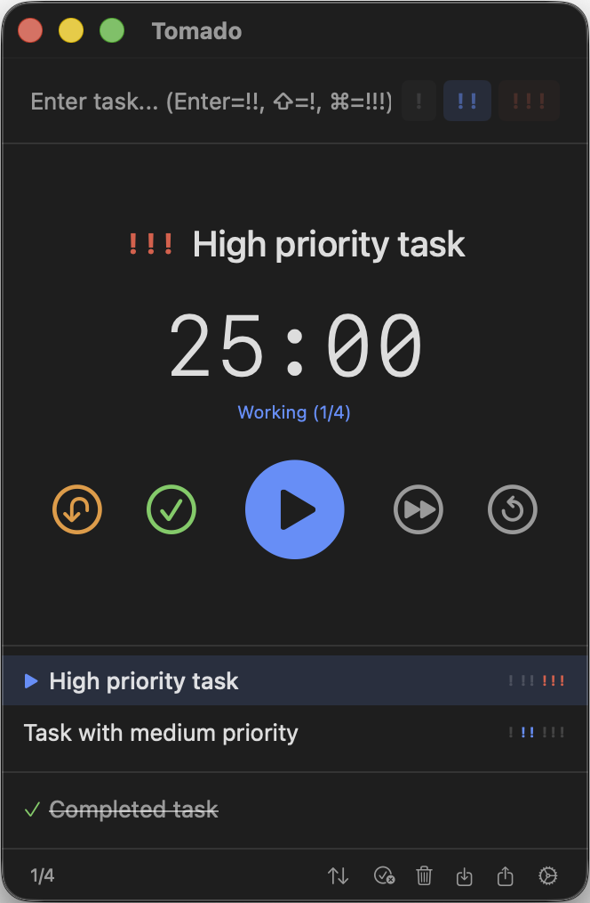

# Tomado

A minimalist Pomodoro timer with task management for macOS.

> **Tomado** = **Toma**to + To**do** + **ma**rk**do**wn

## Design Philosophy

**Focus on what matters.** Tomado is built around the idea that productivity tools should get out of your way. No account required, no cloud sync, no distractions—just you and your tasks.

- **Single-window simplicity**: Everything you need is visible at a glance
- **Keyboard-first**: Every action has a shortcut for flow state
- **Hierarchical tasks**: Break down work naturally with subtasks
- **Priority-driven**: Three levels (!, !!, !!!) keep decisions simple
- **Local-first**: Your data stays on your machine

## Features

- **Pomodoro Timer**: Work sessions, short breaks, and long breaks with customizable durations
- **Task Management**: Simple task list with priority levels (!, !!, !!!)
- **Subtasks**: Organize tasks hierarchically with drag & drop
- **Keyboard-First**: Comprehensive keyboard shortcuts for all actions
- **Import/Export**: Copy tasks from/to clipboard with indentation support
- **Localization**: English and Japanese support

## Screenshot



## Keyboard Shortcuts

| Shortcut | Action |
|----------|--------|
| ⌘P | Play/Pause timer |
| ⌘D | Complete current task |
| ⌘L | Postpone current task |
| ⌘S | Skip current phase |
| ⌘R | Reset cycle |
| ⌘⇧S | Sort by priority |
| ⌘⌫ | Delete completed tasks |
| ⌘⇧⌫ | Delete all tasks |
| ⌘V | Import from clipboard |
| ⌘C | Export to clipboard |
| Enter | Add task (!!) |
| ⇧Enter | Add task (!) |
| ⌘Enter | Add task (!!!) |

## Task Priority

- `!` Low priority (gray)
- `!!` Medium priority (blue) - default
- `!!!` High priority (red)

## Import/Export Format

Tasks use Markdown checkbox format. Priority is indicated by trailing `!` marks.

**Import formats:**
```markdown
- [ ] Task with medium priority
- [ ] High priority task !!!
- [x] Completed task
  - [ ] Subtask (indented)
```

With "Allow list format" enabled in settings:
```markdown
- Task without checkbox
1. Numbered list item
* Asterisk list item
```

**Export format:**

```markdown
- [ ] Task !!
  - [ ] Subtask
- [x] Completed task !!!
```

Note: Subtasks inherit priority from their parent (no `!` marks).

Indent style (spaces/tab) is configurable in settings.

## Requirements

- macOS 14.0 or later

## Installation

1. Download the latest release
2. Move Tomado.app to your Applications folder
3. Launch Tomado

## Building from Source

1. Clone the repository
2. Open `Tomado.xcodeproj` in Xcode
3. Build and run (⌘R)

## License

MIT License

---

# Tomado

macOS向けのミニマリストなポモドーロタイマー＆タスク管理アプリ。

> **Tomado** = **Toma**to + To**do** + **ma**rk**do**wn

## 設計思想

**本質に集中する。** Tomadoは、生産性ツールは邪魔にならないべきという考えで作られています。アカウント不要、クラウド同期なし、余計な機能なし—あなたとタスクだけ。

- **シングルウィンドウ**: 必要な情報は一目で把握
- **キーボードファースト**: すべての操作にショートカット
- **階層タスク**: サブタスクで自然に作業を分割
- **優先度駆動**: 3段階（!, !!, !!!）でシンプルな判断
- **ローカルファースト**: データは自分のマシンに

## 機能

- **ポモドーロタイマー**: 作業・短い休憩・長い休憩のカスタマイズ可能なタイマー
- **タスク管理**: 優先度付き（!, !!, !!!）のシンプルなタスクリスト
- **サブタスク**: ドラッグ＆ドロップで階層的にタスクを整理
- **キーボード操作**: すべての操作にショートカットキー対応
- **インポート/エクスポート**: クリップボード経由でタスクをコピー（インデント対応）
- **多言語対応**: 英語・日本語に対応

## スクリーンショット


## キーボードショートカット

| ショートカット | 操作 |
|---------------|------|
| ⌘P | 再生/停止 |
| ⌘D | 現在のタスクを完了 |
| ⌘L | 現在のタスクを後回し |
| ⌘S | フェーズをスキップ |
| ⌘R | サイクルをリセット |
| ⌘⇧S | 優先度順にソート |
| ⌘⌫ | 完了タスクを削除 |
| ⌘⇧⌫ | すべてのタスクを削除 |
| ⌘V | クリップボードからインポート |
| ⌘C | クリップボードにエクスポート |
| Enter | タスク追加 (!!) |
| ⇧Enter | タスク追加 (!) |
| ⌘Enter | タスク追加 (!!!) |

## タスクの優先度

- `!` 低優先度（グレー）
- `!!` 中優先度（青）- デフォルト
- `!!!` 高優先度（赤）

## インポート/エクスポート形式

Markdownチェックボックス形式を使用。優先度は末尾の `!` で指定。

**インポート形式：**

```markdown
- [ ] 中優先度のタスク
- [ ] 高優先度タスク !!!
- [x] 完了したタスク
  - [ ] サブタスク（インデント）
```

設定で「リスト形式を許可」を有効にすると：

```markdown
- チェックボックスなしのタスク
1. 番号付きリスト
* アスタリスクリスト
```

**エクスポート形式：**

```markdown
- [ ] タスク !!
  - [ ] サブタスク
- [x] 完了タスク !!!
```

※サブタスクは親の優先度を継承（`!` マークなし）

インデントスタイル（スペース/タブ）は設定で変更可能。

## 動作環境

- macOS 14.0以降

## インストール

1. 最新のリリースをダウンロード
2. Tomado.appをアプリケーションフォルダに移動
3. Tomadoを起動

## ソースからビルド

1. リポジトリをクローン
2. `Tomado.xcodeproj`をXcodeで開く
3. ビルドして実行（⌘R）

## ライセンス

MIT License
