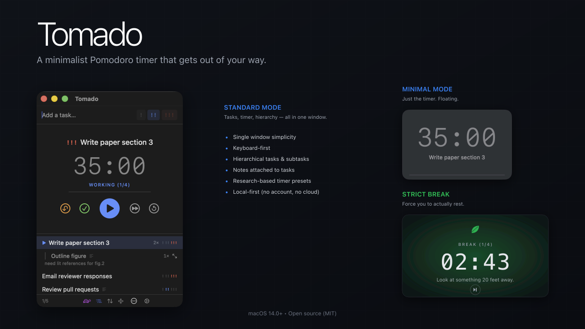
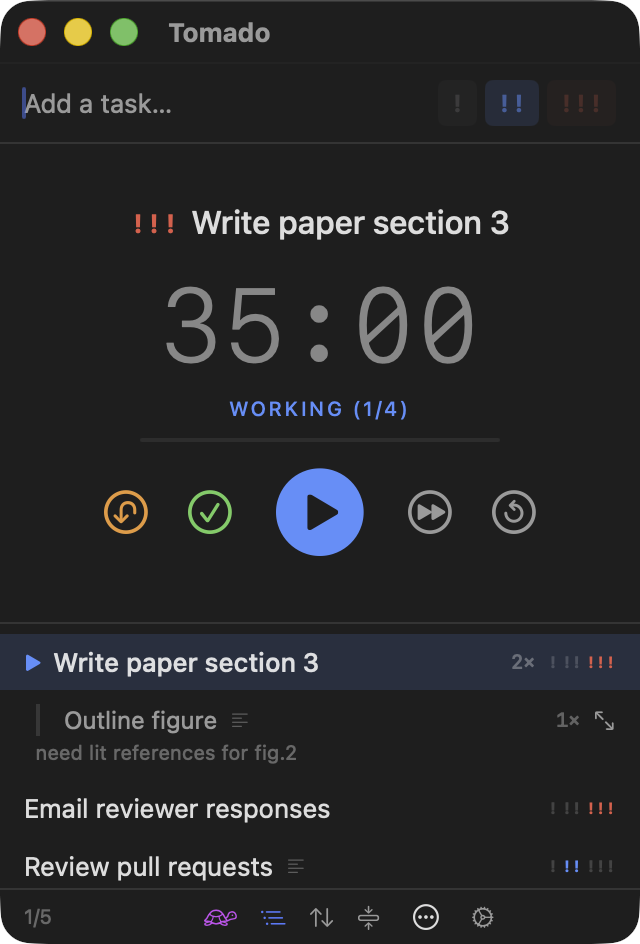

# Tomado



A minimalist Pomodoro timer with task management for macOS.

> **Tomado** = **Toma**to + To**do** + **ma**rk**do**wn

## Design Philosophy

**Focus on what matters.** Tomado is built around the idea that productivity tools should get out of your way. No account required, no cloud sync, no distractions—just you and your tasks.

- **Single-window simplicity**: Everything you need is visible at a glance
- **Keyboard-first**: Every action has a shortcut for flow state
- **Research-based**: Timer presets grounded in cognitive science
- **Hierarchical tasks**: Break down work naturally with subtasks
- **Priority-driven**: Three levels (!, !!, !!!) keep decisions simple
- **Local-first**: Your data stays on your machine

## Features

- **Pomodoro Timer**: Work sessions, short breaks, and long breaks with customizable durations
- **Task Management**: Simple task list with priority levels (!, !!, !!!)
- **Task Notes**: Attach context to a task via indented bullets (`-` lines under a task)
- **Subtasks**: Organize tasks hierarchically with drag & drop — drop onto a row to nest it, drop onto the line between rows (or below the list) to pull it back out
- **Auto-cascade**: Confirmation modal when completing a parent with incomplete subtasks; auto-completes parent when all subtasks done; auto-advances to next task on completion
- **View Modes**: Toggle between separated view and hierarchy view
- **Minimal Mode**: Compact floating window showing only the timer — small, draggable, optionally always-on-top
- **Strict Break**: Optional fullscreen break overlay with rotating wellness reminders, hold-to-skip
- **Quick Capture**: Capture stray thoughts mid-focus without breaking flow (⌘⇧I)
- **Keyboard-First**: Comprehensive keyboard shortcuts for all actions
- **Import/Export**: Markdown-based clipboard import/export with hierarchy and notes
- **Localization**: English and Japanese support

## Screenshot



## Keyboard Shortcuts

| Shortcut | Action |
|----------|--------|
| ⌘P | Play/Pause timer |
| ⌘D | Complete current task |
| ⌘L | Postpone current task |
| ⌘S | Skip current phase |
| ⌘R | Reset cycle |
| ⌘⇧M | Toggle minimal window mode |
| ⌘⇧T | Toggle timer preset (🐇/🐢) |
| ⌘⇧V | Toggle view mode |
| ⌘⇧S | Sort by priority |
| ⌘⇧P | Toggle topmost |
| ⌘⇧I | Quick Capture (capture without breaking focus) |
| ⌘⌫ | Delete completed tasks |
| ⌘⇧⌫ | Delete all tasks |
| ⌘⌥V | Import from clipboard |
| ⌘⌥C | Export to clipboard |
| Enter | Add task (!!) |
| ⇧Enter | Add task (!) |
| ⌘Enter | Add task (!!!) |

## Task Priority

- `!` Low priority (gray)
- `!!` Medium priority (blue) - default
- `!!!` High priority (red)

## Timer Presets

This app offers two timer presets inspired by some research on effort regulation and structured break-taking.

### 🐇 Short Focus Mode (12 min + 3 min break)

Research suggests that people naturally tend to switch tasks approximately every 12 minutes (González & Mark, 2004; Mark et al., 2005). Biwer et al. (2023) compared short systematic breaks (12 min work / 3 min break), long systematic breaks (24 min work / 6 min break), and self-regulated breaks. Both systematic conditions reduced fatigue and improved concentration compared to self-regulated breaks. Notably, the short-interval condition showed favorable trends over the long-interval condition across most indicators, suggesting potential benefits of aligning break timing with natural task-switching rhythms.

### 🐢 Deep Focus Mode (35 min + 10 min break)

For cognitively demanding tasks requiring sustained attention, Ogut (2025) reviewed the literature on the Pomodoro Technique and proposed extended intervals of 35 minutes of focused work followed by 10-minute breaks. While this specific configuration awaits direct experimental validation, it is grounded in cognitive load theory and aims to support deeper engagement without premature interruption.

**References:**

- Biwer, F., Wiradhany, W., oude Egbrink, M. G. A., & de Bruin, A. B. H. (2023). Understanding effort regulation: Comparing 'Pomodoro' breaks and self-regulated breaks. *British Journal of Educational Psychology*, 93(S2), 353–367. https://doi.org/10.1111/bjep.12593
- González, V. M., & Mark, G. (2004). "Constant, constant, multi-tasking craziness": Managing multiple working spheres. *Proceedings of the SIGCHI Conference on Human Factors in Computing Systems*, 113–120. https://doi.org/10.1145/985692.985707
- Mark, G., González, V. M., & Harris, J. (2005). No task left behind? Examining the nature of fragmented work. *Proceedings of the SIGCHI Conference on Human Factors in Computing Systems*, 321–330. https://doi.org/10.1145/1054972.1055017
- Ogut, E. (2025). Assessing the efficacy of the Pomodoro technique in enhancing anatomy lesson retention during study sessions: A scoping review. *BMC Medical Education*, 25(1), 1440. https://doi.org/10.1186/s12909-025-08001-0

## Import/Export Format

Tasks use Markdown checkbox format. Priority is indicated by trailing `!` marks.

**Import formats:**
```markdown
- [ ] Task with medium priority
- [ ] High priority task !!!
- [x] Completed task
  - [ ] Subtask (indented)
- [ ] Task with notes
  - This is contextual note attached to the task
  - Another line of note
```

Indented bullets without checkboxes (and quote lines with `>`) are imported as **notes** attached to the parent task.

With "Allow list format" enabled in settings:
```markdown
- Task without checkbox
1. Numbered list item
* Asterisk list item
```

Note: enabling "Allow list format" makes indented `-` bullets become subtasks rather than notes. Disable it to use notes.

**Export format:**

```markdown
- [ ] Task !!
  - [ ] Subtask !!
- [x] Completed task !!!
- [ ] Task with notes !!
  - Contextual note
```

Note: Priority marks are written for every task (including subtasks) so an export → import round trip is lossless. Notes are exported as indented bullets under their task.

Indent style (spaces/tab) is configurable in settings.

## Requirements

- macOS 14.0 or later

## Installation

1. Download the latest release
2. Move Tomado.app to your Applications folder
3. Launch Tomado

## Building from Source

1. Clone the repository
2. Open `Tomado.xcodeproj` in Xcode
3. Build and run (⌘R)

## License

MIT License

---

# Tomado

macOS向けのミニマリストなポモドーロタイマー＆タスク管理アプリ。

> **Tomado** = **Toma**to + To**do** + **ma**rk**do**wn

## 設計思想

**本質に集中する。** 生産性ツールは邪魔にならないべき。アカウント不要、クラウド同期なし、余計な機能なし—あなたとタスクだけ。

- **シングルウィンドウ**: 必要な情報を一目で把握
- **キーボードファースト**: すべての操作にショートカット
- **研究ベース**: 認知科学に基づくタイマープリセット
- **階層タスク**: サブタスクで作業を自然に分割
- **優先度駆動**: 3段階（!, !!, !!!）でシンプルに判断
- **ローカルファースト**: データは手元に

## 機能

- **ポモドーロタイマー**: 作業・短い休憩・長い休憩のカスタマイズ可能なタイマー
- **タスク管理**: 優先度付き（!, !!, !!!）のシンプルなタスクリスト
- **タスクメモ**: タスク配下のインデント `-` 行を文脈メモとして保持
- **サブタスク**: ドラッグ＆ドロップで階層的にタスクを整理。行の上に落とすとサブタスク化、行間のラインやリスト下端に落とすとその階層に引き上げ
- **自動カスケード**: 親タスク完了時に未完了サブタスクがあれば確認モーダル。全サブタスク完了時は親も自動完了。完了後は次の未完了タスクへ自動遷移
- **ビューモード**: 分離ビューと階層ビューを切り替え
- **ミニマルモード**: タイマーだけの小さな浮遊ウィンドウ。ドラッグ移動可、最前面固定オプション
- **厳格な休憩**: 休憩中に全画面オーバーレイ + ローテーションするウェルネス提示 + 長押しスキップ
- **クイックキャプチャ**: 集中を切らずに浮かんだ思考を即座に記録 (⌘⇧I)
- **キーボード操作**: すべての操作にショートカットキー対応
- **インポート/エクスポート**: Markdown 形式でクリップボード経由 (階層 + メモ対応)
- **多言語対応**: 英語・日本語に対応

## スクリーンショット


## キーボードショートカット

| ショートカット | 操作 |
|---------------|------|
| ⌘P | 再生/停止 |
| ⌘D | 現在のタスクを完了 |
| ⌘L | 現在のタスクを後回し |
| ⌘S | フェーズをスキップ |
| ⌘R | サイクルをリセット |
| ⌘⇧M | ミニマルウィンドウ切替 |
| ⌘⇧T | タイマープリセット切替 (🐇/🐢) |
| ⌘⇧V | ビューモード切替 |
| ⌘⇧S | 優先度順にソート |
| ⌘⇧P | 最前面固定切替 |
| ⌘⇧I | クイックキャプチャ (集中を切らずに記録) |
| ⌘⌫ | 完了タスクを削除 |
| ⌘⇧⌫ | すべてのタスクを削除 |
| ⌘⌥V | クリップボードからインポート |
| ⌘⌥C | クリップボードにエクスポート |
| Enter | タスク追加 (!!) |
| ⇧Enter | タスク追加 (!) |
| ⌘Enter | タスク追加 (!!!) |

## タスクの優先度

- `!` 低優先度（グレー）
- `!!` 中優先度（青）- デフォルト
- `!!!` 高優先度（赤）

## タイマープリセット

努力調節と休憩に関する研究に基づく2つのプリセットを用意しています。

### 🐇 ショートフォーカスモード（12分 + 3分休憩）

人は約12分ごとにタスクを切り替える傾向があります（González & Mark, 2004; Mark et al., 2005）。Biwer et al. (2023) は短い定期休憩（12分作業／3分休憩）と長い定期休憩（24分作業／6分休憩）、自己調整休憩を比較し、どちらの定期休憩も自己調整より疲労軽減・集中力向上に効果的だったと報告しています。特に短い間隔の方が多くの指標で良好な傾向を示しました。

### 🐢 ディープフォーカスモード（35分 + 10分休憩）

集中力を要するタスク向けに、Ogut (2025) はポモドーロ・テクニックの文献レビューを通じて35分作業＋10分休憩という拡張間隔を提案しています。この構成は認知負荷理論に基づき、中断による思考の分断を減らしながら深い集中を促すことを目指しています。

**参考文献：**

- Biwer, F., Wiradhany, W., oude Egbrink, M. G. A., & de Bruin, A. B. H. (2023). Understanding effort regulation: Comparing 'Pomodoro' breaks and self-regulated breaks. *British Journal of Educational Psychology*, 93(S2), 353–367.
- González, V. M., & Mark, G. (2004). "Constant, constant, multi-tasking craziness": Managing multiple working spheres. *Proceedings of the SIGCHI Conference on Human Factors in Computing Systems*, 113–120.
- Mark, G., González, V. M., & Harris, J. (2005). No task left behind? Examining the nature of fragmented work. *Proceedings of the SIGCHI Conference on Human Factors in Computing Systems*, 321–330.
- Ogut, E. (2025). Assessing the efficacy of the Pomodoro technique in enhancing anatomy lesson retention during study sessions: A scoping review. *BMC Medical Education*, 25(1), 1440.

## インポート/エクスポート形式

Markdownチェックボックス形式を使用。優先度は末尾の `!` で指定。

**インポート形式：**

```markdown
- [ ] 中優先度のタスク
- [ ] 高優先度タスク !!!
- [x] 完了したタスク
  - [ ] サブタスク（インデント）
- [ ] メモ付きタスク
  - これはタスクの文脈メモ
  - 別の行のメモ
```

チェックボックスのないインデント `-` 行（または `>` 引用行）は親タスクのメモとしてインポートされます。

設定で「リスト形式を許可」を有効にすると：

```markdown
- チェックボックスなしのタスク
1. 番号付きリスト
* アスタリスクリスト
```

注: 「リスト形式を許可」をONにすると、インデントされた `-` 行はメモではなくサブタスクとしてインポートされます。メモ機能を使うにはOFFにしてください。

**エクスポート形式：**

```markdown
- [ ] タスク !!
  - [ ] サブタスク !!
- [x] 完了タスク !!!
- [ ] メモ付きタスク !!
  - 文脈メモ
```

※優先度マークはサブタスクにも出力されます（エクスポート→インポートで情報が落ちないようにするため）。メモはタスク配下のインデント `-` 行として出力されます。

インデントスタイル（スペース/タブ）は設定で変更可能。

## 動作環境

- macOS 14.0以降

## インストール

1. 最新のリリースをダウンロード
2. Tomado.appをアプリケーションフォルダに移動
3. Tomadoを起動

## ソースからビルド

1. リポジトリをクローン
2. `Tomado.xcodeproj`をXcodeで開く
3. ビルドして実行（⌘R）

## ライセンス

MIT License
